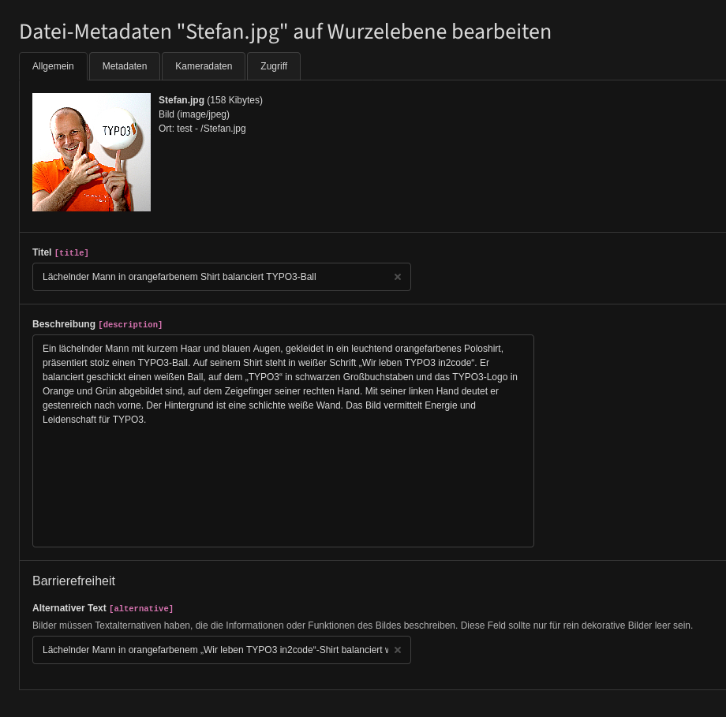
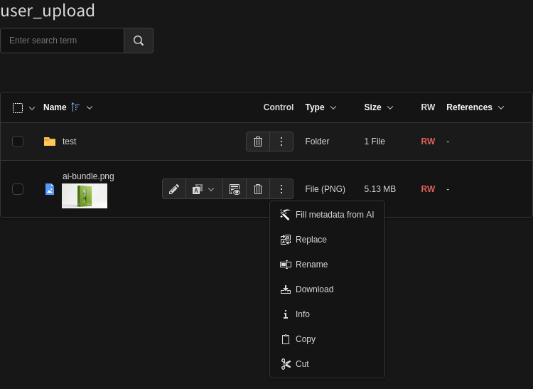
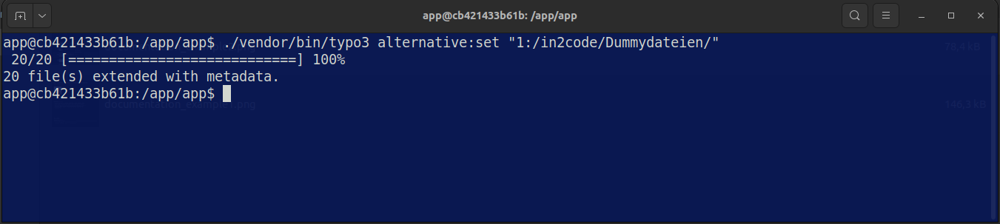

# Alternative - AI generated metatags for images in TYPO3 with Google Gemini

## Introduction

This TYPO3 extension allows setting alternative texts, title labels and a description for images in a filestorage.
This can be done via file list backend module or via command on the CLI.

Example metadata labels from AI:


Example backend integration:


Example CLI command:


## Google Gemini API

- To use the extension, you need a **Google Gemini API** key. You can register for one
    at https://aistudio.google.com/app/api-keys.
- Alternatively, you can implement your own LLM provider (see [Custom LLM Integration](#custom-llm-integration-like-chatgpt-claude-mistral-etc) below).

## Installation

```
composer req in2code/alternative
```

After that, you have to set some initial configuration in Extension Manager configuration:

| Title                | Default value | Description                                                                                                                                                |
|----------------------|---------------|------------------------------------------------------------------------------------------------------------------------------------------------------------|
| setAlternative       | 1             | Toggle function: Set a value for alternative text                                                                                                          |
| setTitle             | 1             | Toggle function: Set a value for image title                                                                                                               |
| setDescription       | 1             | Toggle function: Set a value for a description                                                                                                             |
| showButtonInFileList | 1             | Show or hide button in backend module file list                                                                                                            |
| apiKey               | -             | Google Gemini API key. You can let this value empty and simply use ENV_VAR "GOOGLE_API_KEY" instead if you want to use CI pipelines for this setting       |
| limitToLanguages     | -             | If set, limit to this language identifiers only. Use a commaseparated list of numbers                                                                      |
| maxLengthTitle       | 50            | Maximum number of characters for the title field                                                                                                           |
| maxLengthAlternative | 125           | Maximum number of characters for the alternative text field                                                                                                |
| maxLengthDescription | 255           | Maximum number of characters for the description field                                                                                                     |
| promptPrefixFile     | -             | Path to a text file with custom prompt prefix (e.g. `EXT:extension/Resources/Private/prompt.txt` or `fileadmin/promptprefix.txt` or `/var/www/prompt.txt`) |

Note: It's recommended to use ENV vars for in2code/alternative instead of saving the API-Key in Extension Manager configuration

```
GOOGLE_API_KEY=your_api_key_from_google
```

## CLI commands

```
# Set metadata for all image files in storage 1
./vendor/bin/typo3 alternative:set "1:/"

# Set metadata for all image files in a subfoler in storage 1 (maybe "fileadmin/in2code/folder/")
./vendor/bin/typo3 alternative:set "1:/in2code/folder/"

# Enforce to set metadata for all image files in storage 1
./vendor/bin/typo3 alternative:set "1:/" 1
```

## Custom LLM Integration (like ChatGPT, Claude, Mistral, etc.)

Alternative uses a factory pattern to allow custom LLM providers. By default, it uses Google Gemini,
but you can easily integrate other AI services (OpenAI, Claude, local models, etc.).

### Implementing a Custom LLM Repository

1. Create a custom repository class implementing `RepositoryInterface` - see example for OpenAI ChatGPT:

```php
<?php

declare(strict_types=1);

namespace Vendor\MyExtension\Domain\Repository\Llm;

use In2code\Alternative\Domain\Repository\Llm\AbstractRepository;
use In2code\Alternative\Domain\Repository\Llm\RepositoryInterface;
use In2code\Alternative\Exception\ApiException;
use In2code\Alternative\Exception\ConfigurationException;
use TYPO3\CMS\Core\Http\RequestFactory;
use TYPO3\CMS\Core\Resource\File;

class ChatGptRepository extends AbstractRepository implements RepositoryInterface
{
    private string $apiKey = '';
    private string $apiUrl = 'https://api.openai.com/v1/chat/completions';

    public function __construct(
        protected RequestFactory $requestFactory,
    ) {
        parent::__construct($requestFactory);
        $this->apiKey = getenv('OPENAI_API_KEY') ?: '';
    }

    public function checkApiKey(): void
    {
        if ($this->apiKey === '') {
            throw new ConfigurationException('OpenAI API key not configured', 1735646000);
        }
    }

    public function getApiUrl(): string
    {
        return $this->apiUrl;
    }

    /**
     * Analyze image and return metadata for all requested languages in one API call
     *
     * @param File $file
     * @param array $languageCodes e.g. ['en', 'de', 'fr']
     * @return array e.g. ['en' => ['title' => '...', ...], 'de' => [...], ...]
     */
    public function analyzeImageForLanguages(File $file, array $languageCodes): array
    {
        $this->checkApiKey();
        $imageData = base64_encode($file->getContents());
        return $this->generateMetadataWithChatGpt($imageData, $file->getMimeType(), $languageCodes);
    }

    protected function generateMetadataWithChatGpt(string $imageData, string $mimeType, array $languageCodes): array
    {
        $payload = [
            'model' => 'gpt-4o',
            'messages' => [
                [
                    'role' => 'user',
                    'content' => [
                        ['type' => 'text', 'text' => $this->getPrompt($languageCodes)],
                        [
                            'type' => 'image_url',
                            'image_url' => [
                                'url' => 'data:' . $mimeType . ';base64,' . $imageData,
                            ],
                        ],
                    ],
                ],
            ],
            'temperature' => 0.1,
            'max_tokens' => 2000,
        ];

        $options = [
            'headers' => [
                'Authorization' => 'Bearer ' . $this->apiKey,
                'Content-Type' => 'application/json',
            ],
            'body' => json_encode($payload),
        ];

        $response = $this->requestFactory->request($this->getApiUrl(), $this->requestMethod, $options);

        if ($response->getStatusCode() !== 200) {
            throw new ApiException(
                'Failed to analyze image with ChatGPT: ' . $response->getBody()->getContents(),
                1735646001
            );
        }

        $responseData = json_decode($response->getBody()->getContents(), true);
        return $this->parseResponse($responseData, $languageCodes);
    }

    protected function parseResponse(array $responseData, array $languageCodes): array
    {
        if (isset($responseData['choices'][0]['message']['content']) === false) {
            throw new ApiException('Invalid ChatGPT API response structure', 1735646002);
        }

        $text = $responseData['choices'][0]['message']['content'];

        // Extract JSON from markdown code blocks if present
        if (preg_match('~```json\s*(\{.*?\})\s*```~s', $text, $matches)) {
            $text = $matches[1];
        } elseif (preg_match('~```\s*(\{.*?\})\s*```~s', $text, $matches)) {
            $text = $matches[1];
        }

        $data = json_decode($text, true);
        if ($data === null) {
            throw new ApiException('Could not parse ChatGPT response as JSON', 1735646003);
        }

        $result = [];
        foreach ($languageCodes as $languageCode) {
            $languageData = $data[$languageCode] ?? [];
            $result[$languageCode] = [
                'title' => $languageData['title'] ?? '',
                'description' => $languageData['description'] ?? '',
                'alternativeText' => $languageData['alternativeText'] ?? '',
            ];
        }
        return $result;
    }
}
```

2. Register your custom repository in `ext_localconf.php`:

```php
<?php
defined('TYPO3') || die();

// Register custom LLM repository
$GLOBALS['TYPO3_CONF_VARS']['EXTENSIONS']['alternative']['llmRepositoryClass']
    = \Vendor\MyExtension\Domain\Repository\Llm\ChatGptRepository::class;
```

**Hint**: Don't forget to register your Repository in your Services.yaml and flush caches

## Changelog and breaking changes

### Changelog

| Version   | Date       | State   | Description                                                                                      |
|-----------|------------|---------|--------------------------------------------------------------------------------------------------|
| 4.0.0 !!! | 2026-02-04 | Feature | Performance update for systems with a lot of languages                                           |
| 3.0.1     | 2026-02-02 | Task    | Add funding section to composer.json                                                             |
| 3.0.0     | 2026-01-28 | Feature | Configure max length, configure a pre-prompt text, some improvements for local development       |
| 2.0.0     | 2025-12-31 | Feature | Prepare overruling of the GeminiRepository                                                       |
| 1.2.0     | 2025-12-07 | Feature | Support TYPO3 14, use better titles and icons, decrease length for metadata, skip missing images |
| 1.1.0     | 2025-12-04 | Feature | Add ddev as local environment, prevent syntax error in PHP 8.2                                   |
| 1.0.0     | 2025-12-03 | Task    | Initial release of in2code/alternative                                                           |

### Breaking changes

**Update to version 4.0.0:** If you have implemented your own LLM by extending `RepositoryInterface` with your own PHP class, you have to adjust your integration with multilanguage support now. See implementation example above.


## Contribution with ddev

This repository provides a [DDEV](https://ddev.readthedocs.io)-backed development environment. If DDEV is installed, simply run the following
commands to quickly set up a local environment with example usages:

* `ddev start`
* `ddev initialize`

**Backend Login:**
```
Username: admin
Password: admin
```

**Installation hint:**

1. Install ddev before, see: https://ddev.readthedocs.io/en/stable/#installation
2. Install git-lfs before, see: https://git-lfs.github.com/
3. Add the API key in `.ddev/.env` like

```
GOOGLE_API_KEY=your_api_key_from_google
```

### DDEV Commands

| Command                   | Description                                                        |
|---------------------------|--------------------------------------------------------------------|
| `ddev initialize`         | Import test data into ddev (database and configurations)           |
| `ddev typo3 [command]`    | Run TYPO3 CLI commands (e.g. `ddev typo3 cache:flush`)             |
| `ddev createdumpfile`     | Create database dump and save to `.ddev/data/db.sql.gz`            |
| `ddev createfilesarchive` | Create fileadmin archive and save to `.ddev/data/fileadmin.tar.gz` |